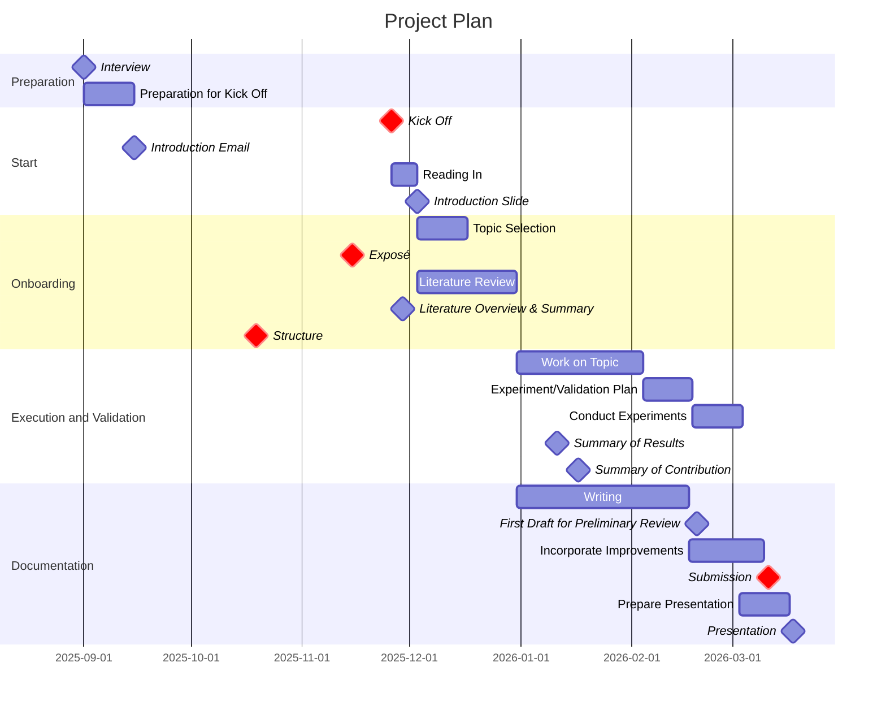

```mermaid
gantt
title Project Plan
dateFormat YYYY-MM-DD
todaymarker on
section Preparation
Interview: milestone, 2025-09-01, 0d
Preparation for Kick Off: id1, 2025-09-01, 14d
section Start
Kick Off: milestone, crit, 2025-11-26, 0d
Introduction Email: milestone, 2025-09-15, 0d
Reading In: id2, 2025-11-26, 7d
Introduction Slide: milestone, 2025-12-03, 0d
section Onboarding
Topic Selection: id3, after id2, 14d
Exposé: milestone, crit, 2025-11-15, 0d
Literature Review: id4, after id2, 4w
Literature Overview & Summary: milestone, 2025-11-29, 0d
Structure: milestone, crit, 2025-10-19, 0d
Section Execution and Validation
Work on Topic: id6, after id4, 5w
Experiment/Validation Plan: id7, after id6, 2w
Conduct Experiments: idx, after id7, 14d
Summary of Results: milestone, 2026-01-11, 0d
Summary of Contribution: milestone, 2026-01-17, 0d
section Documentation
Writing: idschreiben, after id4, 2026-02-17
First Draft for Preliminary Review: milestone, 2026-02-19, 0d
Incorporate Improvements: id11, after idschreiben, 21d
Submission: milestone, crit, 2026-03-11, 0d
Prepare Presentation: id12, 2026-03-03, 14d
Presentation: milestone, 2026-03-18, 0d

```
