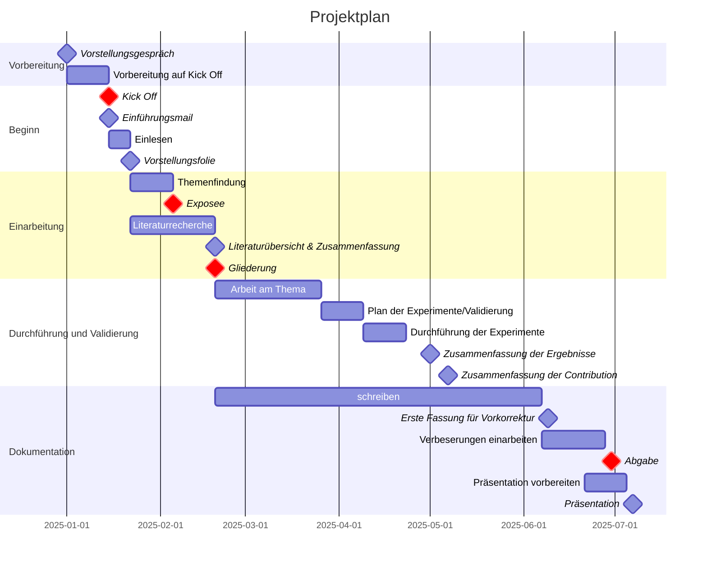

```mermaid
gantt
    title Projektplan
    dateFormat  YYYY-MM-DD
    todaymarker on
    
    section Vorbereitung
    Vorstellungsgespräch: milestone, 2025-01-01, 0d
    Vorbereitung auf Kick Off: id1, 2025-01-01, 14d
    
    section Beginn
    Kick Off: milestone, crit, 2025-01-15, 0d
    Einführungsmail: milestone, 2025-01-15, 0d
    Einlesen: id2, 2025-01-15, 7d
    Vorstellungsfolie: milestone, 2025-01-22, 0d
    
    section Einarbeitung
    Themenfindung: id3, after id2, 14d
    Exposee: milestone, crit, 2025-02-05, 0d
    
    Literaturrecherche: id4, after id2, 4w
    Literaturübersicht & Zusammenfassung: milestone, 2025-02-19, 0d
    Gliederung: milestone, crit, 2025-02-19, 0d
    
    section Durchführung und Validierung
    Arbeit am Thema: id6, after id4, 5w
    Plan der Experimente/Validierung: id7, after id6, 2w
    Durchführung der Experimente: idx, after id7, 14d
    Zusammenfassung der Ergebnisse: milestone, 2025-05-01, 0d
    Zusammenfassung der Contribution: milestone, 2025-05-7, 0d
    
    section Dokumentation
    schreiben: idschreiben, after id4, 2025-06-07
    Erste Fassung für Vorkorrektur: milestone, 2025-06-09, 0d
    Verbeserungen einarbeiten: id11, after idschreiben, 21d
    Abgabe: milestone, crit, 2025-06-30, 0d
    Präsentation vorbereiten: id12, 2025-06-21, 14d
    Präsentation: milestone, 2025-07-07, 0d

```
